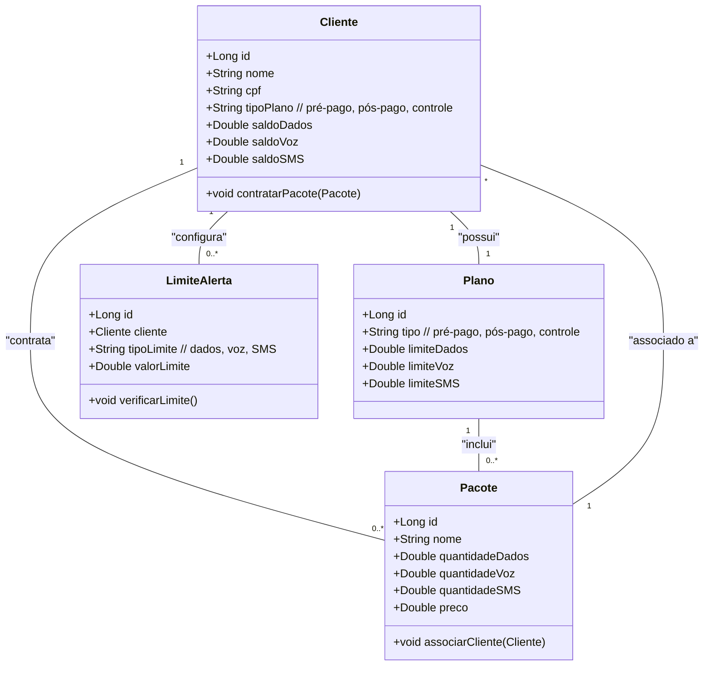

# Diagrama de Classes - Gestão de Planos e Pacotes de Telefonia Móvel

## Diagrama de Classes

```mermaid
 classDiagram
    class Cliente {
        +Long id
        +String nome
        +String cpf
        +String tipoPlano  // pré-pago, pós-pago, controle
        +Double saldoDados
        +Double saldoVoz
        +Double saldoSMS
        +void contratarPacote(Pacote)
    }

    class Pacote {
        +Long id
        +String nome
        +Double quantidadeDados
        +Double quantidadeVoz
        +Double quantidadeSMS
        +Double preco
        +void associarCliente(Cliente)
    }

    class Plano {
        +Long id
        +String tipo // pré-pago, pós-pago, controle
        +Double limiteDados
        +Double limiteVoz
        +Double limiteSMS
    }

    class LimiteAlerta {
        +Long id
        +Cliente cliente
        +String tipoLimite  // dados, voz, SMS
        +Double valorLimite
        +void verificarLimite()
    }

    %% Definindo os relacionamentos e cardinalidades

    Cliente "1" -- "0..*" Pacote : "contrata"
    Cliente "1" -- "1" Plano : "possui"
    Plano "1" -- "0..*" Pacote : "inclui"
    Cliente "1" -- "0..*" LimiteAlerta : "configura"
    Pacote "1" -- "*" Cliente : "associado a"


```
